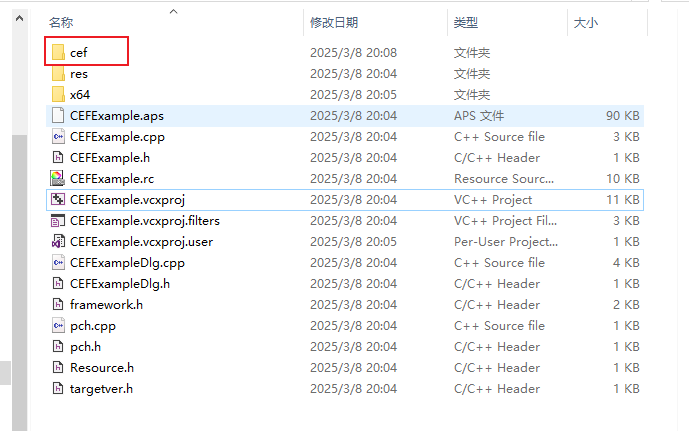
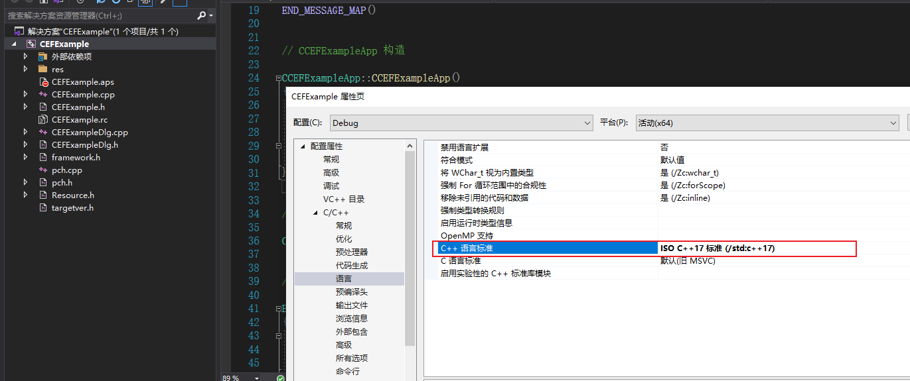

# CEF 在 MFC 中的使用

## 工程配置
1、首先创建一个MFC对话框工程


创建完运行测试效果如下


2、MFC工程引入CEF库

将 CEF 目录下的 cef子目录下载解压后放到MFC工程中：



然后在VS中对工程右键 -> 属性 -> C/C++ -> 常规 -> 附加包含目录，添加“.\cef”


然后在VS中对工程右键 -> 属性 -> C/C++ -> 代码生成 -> 运行库，调整为 MT (debug调整为MTd，Release为MT)


然后在VS中对工程右键 -> 属性 -> C/C++ -> 语言 -> c++语言标准，调整为 MT (debug调整为MTd，Release为MT)



然后在VS中对工程右键 -> 属性 -> C/C++ -> 预编译头 -> 预编译头，调整为不适用预编译头


然后在VS中对工程右键 -> 属性 -> 高级 -> MFC的使用，改为“在静态库中使用MFC”


然后在工程中找到 framework.h，在最下面添加：
```C++

#ifdef _DEBUG
#pragma comment(lib, ".\\CEF\\bin\\Debug\\libcef.lib")
#pragma comment(lib, ".\\CEF\\bin\\Debug\\libcef_dll_wrapper.lib")
#pragma comment(lib, ".\\CEF\\bin\\Debug\\cef_sandbox.lib")
#else
#pragma comment(lib, ".\\CEF\\bin\\Release\\libcef.lib")
#pragma comment(lib, ".\\CEF\\bin\\Release\\libcef_dll_wrapper.lib")
#pragma comment(lib, ".\\CEF\\bin\\Release\\cef_sandbox.lib")
#endif

```


然后对工程右键生成，生成信息中会显示工程exe生成位置，一般是代码的解决方案文件所在目录同级的 x64\Debug\ 中，定位到exe所在位置，在CEF目录的子目录中下载 Run64.zip， 然后解压后将对应子项目下的文件全部拷贝到exe所在目录：


至此，CEF库导入完成

## 测试代码

首先去将cef目录下的子目录 test 中将测试类拷贝到工程下，这几个类其实来自于CEF源码中自带的cefsimple工程，只是把simple_app.cc 中的默认路径改成了百度，其他无任何修改：


在工程中导入这几个文件，工程右键 -> 添加 -> 现有项，选择刚才考过来的文件


找到工程名称+Dlg 的类,

```C++
#include "include/cef_command_line.h"
#include "include/cef_sandbox_win.h"
#include "simple_app.h"
#include "simple_handler.h"
```


在当前类定位到 OnInitDialog 函数


在TODO 后添加： 

```C++
    HINSTANCE hInstance = AfxGetInstanceHandle();
    int exit_code;
    void* sandbox_info = nullptr;
    CefMainArgs main_args(hInstance);
    exit_code = CefExecuteProcess(main_args, nullptr, sandbox_info);
    if (exit_code >= 0) {
        return exit_code;
    }
    CefRefPtr<CefCommandLine> command_line = CefCommandLine::CreateCommandLine();
    command_line->InitFromString(::GetCommandLineW());
    CefSettings settings;
    settings.no_sandbox = true;
    CefRefPtr<SimpleApp> app(new SimpleApp);
    CefInitialize(main_args, settings, app.get(), sandbox_info);

    CefRunMessageLoop();
    CefShutdown();
```


然后运行


会看到一个有浏览器并且打开了百度的页面，
以及两个空的对话框。
这份测试代码是有bug的，不过只是为了测试CEF库是否可以正常使用，相关bug暂不定位处理；