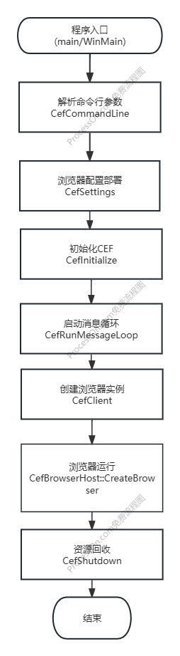

[toc]

# CEF 入门

## 官方文档
CEF官方给出了所有的API和类说明文档
https://cef-builds.spotifycdn.com/docs/133.4/index.html

然后还有一些相关的入门程序介绍：
https://bitbucket.org/chromiumembedded/cef/wiki/Tutorial
https://bitbucket.org/chromiumembedded/cef/wiki/GeneralUsage.md

另外下载的CEF源码中也自带两个示例工程，
* cefsimple  一个最简单的通过CEF创建一个浏览器进程的示例
* cefclient  一个完善的

## 重要概念

* **CefApp**
全局应用程序接口，处理进程级别的回调,可以理解为CEF的进程实例。
关键方法：
    OnBeforeCommandLineProcessing()：修改命令行参数。
    GetBrowserProcessHandler()：返回 Browser 进程处理器。
    GetRenderProcessHandler(): 返回特定于渲染进程的功能的处理程序。

* **CefBrowserProcessHandler**
专门用于处理浏览器进程（Browser Process）的生命周期和全局事件，一般与CefApp共同集成。
关键方法：
    OnContextInitialized(): 当浏览器进程的上下文初始化完成（CEF 内部初始化完毕）时回调。
    OnBeforeChildProcessLaunch()：在启动子进程（如渲染进程、GPU 进程）前调用。
    .OnScheduleMessageLoopWork()：当 CEF 需要执行定时任务（如定时器回调、异步操作）时触发，可用于集成自定义消息循环。


* **CefClient**
浏览器实例的客户端接口，处理单个浏览器事件（如加载、弹窗、生命周期）。
关键方法：
    GetLifeSpanHandler()：处理浏览器窗口生命周期（如创建/关闭）。
    GetLoadHandler()：处理页面加载事件。
    GetDisplayHandler()：处理页面显示事件（如标题更新）。

* **CefDisplayHandler**
用于处理浏览器显示相关事件的接口，例如页面标题变化、地址栏 URL 更新、全屏模式切换、控制台消息输出等。它允许开发者监听和响应浏览器内容的显示状态变化，常用于更新应用程序界面或记录调试信息。
关键方法：
    OnTitleChange()：当页面标题（document.title）发生变化时响应。
    OnAddressChange()：当页面 URL（地址栏）发生变化时（例如跳转、重定向）。
    OnFullscreenModeChange()：当页面进入或退出全屏模式时（例如调用 element.requestFullscreen()）。
    OnConsoleMessage()：当页面通过 console.log()、console.error() 输出日志时。

* **CefFrame**
表示页面中的一个框架（如主框架、iframe）。
关键方法：
    LoadURL()：加载指定 URL。
    ExecuteJavaScript()：执行 JavaScript 代码。
    GetURL()：获取当前 URL。

* **CefV8Context**
JavaScript 执行上下文，用于与页面 JS 交互。
关键方法：
    GetGlobal()：获取全局对象。
    Eval()：执行 JS 代码并返回结果。

* **CefRequestHandler**
处理网络请求（如拦截、重定向）。
关键方法：
    OnBeforeBrowse()：在加载 URL 前拦截。
    OnResourceLoadComplete()：资源加载完成回调。

* **CefLifeSpanHandler**
用于管理浏览器窗口生命周期的接口。它负责处理浏览器窗口的创建、关闭、弹出窗口拦截等事件。通过实现该接口，开发者可以控制浏览器窗口的创建和销毁逻辑，例如阻止或自定义弹窗行为、监听窗口关闭事件等。
关键方法：
    OnBeforePopup()：当页面尝试通过 JavaScript（如 window.open）或用户操作（如点击链接）打开新窗口（弹窗）时触发。
    OnAfterCreated()：浏览器窗口创建完成后触发。
    DoClose()：当浏览器窗口即将关闭时（例如用户点击关闭按钮）。
    OnBeforeClose()：浏览器窗口即将被销毁前触发。

## 源码示例cefsimple讲解
以源码中带的cefsimple为例，再加深一下对刚才说的概念的了解；

在之前的CEF EXAMPLE中 我们在 CCEFExampleDlg::OnInitDialog() 中添加了如下代码，请对照代码注释看一下

```C++
    // 先是获取当前应用程序实例的句柄，当然这个是MFC的语法哈；
    HINSTANCE hInstance = AfxGetInstanceHandle();

    int exit_code;
    void* sandbox_info = nullptr;
    // 传递当前实例句柄来初始化 CEF 的主进程参数
    CefMainArgs main_args(hInstance);
    // 执行子进程，检测若当前是子进程则直接退出；
    exit_code = CefExecuteProcess(main_args, nullptr, sandbox_info);
    if (exit_code >= 0) {
        return exit_code;
    }

    // 创建一个命令行对象，用于解析和传递命令行参数，
    CefRefPtr<CefCommandLine> command_line = CefCommandLine::CreateCommandLine();
    // 从系统命令行初始化;
    command_line->InitFromString(::GetCommandLineW());

    // 配置 CEF 全局设置
    CefSettings settings;
    // 禁用沙盒，因为我们的库是2019编出来的，与最新版沙盒库不兼容，实际的生产环境建议找一个能兼容沙盒库的版本哈
    settings.no_sandbox = true;

    // 创建自定义的 CefApp 派生类实例SimpleApp
    CefRefPtr<SimpleApp> app(new SimpleApp);

    // 初始化 CEF 主进程，传入参数、设置和 App 实例
    CefInitialize(main_args, settings, app.get(), sandbox_info);

    // 启动 CEF 消息循环，阻塞在此处处理窗口事件和 CEF 内部任务
    CefRunMessageLoop();

    // 关闭 CEF 并释放资源（必须在所有 CEF 对象销毁后调用）
    CefShutdown();
```
至此，也就是我们对CEF进程的初始化就完成了，但是我们只是初始化了CEF的主进程，为什么启动程序的时候会弹出一个百度网页呢，这就需要看SimpleApp了；

先看SimpleApp的声明：
```C++
#include "include/cef_app.h"

// 先是继承CefApp作为进程实例，又继承了CefBrowserProcessHandler处理浏览器进程的生命周期事件
class SimpleApp : public CefApp, public CefBrowserProcessHandler {
    public:
        SimpleApp();

        // CefApp 接口重写
        CefRefPtr<CefBrowserProcessHandler> GetBrowserProcessHandler() override {
        return this;
        }

        // CefBrowserProcessHandler 的接口重写，当浏览器进程的上下文初始化完成时回调
        void OnContextInitialized() override;

        // CefBrowserProcessHandler 的接口重写，取创建的浏览器窗口的默认客户端。
        CefRefPtr<CefClient> GetDefaultClient() override;

    private:
        // CEF 自带的宏，简化引用计数接口的实现
        IMPLEMENT_REFCOUNTING(SimpleApp);
};
```
再看SimpleApp的实现：

```C++
#include "simple_app.h"

// CEF 相关头文件
#include "include/cef_browser.h"           // 浏览器核心功能
#include "include/cef_command_line.h"      // 命令行参数解析
#include "include/views/cef_browser_view.h" // 基于视图的浏览器界面
#include "include/views/cef_window.h"      // 窗口管理
#include "include/wrapper/cef_helpers.h"   // CEF 辅助宏（如CEF_REQUIRE_UI_THREAD）
#include "simple_handler.h"                // 自定义的浏览器事件处理器

namespace {

// Window 委托类：管理视图框架窗口的行为
class SimpleWindowDelegate : public CefWindowDelegate {
 public:
  SimpleWindowDelegate(CefRefPtr<CefBrowserView> browser_view,
                       cef_runtime_style_t runtime_style,
                       cef_show_state_t initial_show_state)
      : browser_view_(browser_view),
        runtime_style_(runtime_style),
        initial_show_state_(initial_show_state) {}

  // 窗口创建完成时触发
  void OnWindowCreated(CefRefPtr<CefWindow> window) override {
    // 将浏览器视图添加到窗口
    window->AddChildView(browser_view_);

    // 根据初始显示状态显示窗口
    if (initial_show_state_ != CEF_SHOW_STATE_HIDDEN) {
      window->Show();
    }
  }

  // 窗口销毁时触发
  void OnWindowDestroyed(CefRefPtr<CefWindow> window) override {
    browser_view_ = nullptr; // 释放浏览器视图引用
  }

  // 判断窗口是否可以关闭
  bool CanClose(CefRefPtr<CefWindow> window) override {
    // 询问浏览器是否允许关闭
    CefRefPtr<CefBrowser> browser = browser_view_->GetBrowser();
    if (browser) {
      return browser->GetHost()->TryCloseBrowser();
    }
    return true;
  }

  // 设置窗口默认尺寸
  CefSize GetPreferredSize(CefRefPtr<CefView> view) override {
    return CefSize(800, 600); // 800x600 像素
  }

  // 返回窗口初始显示状态（最大化/最小化等）
  cef_show_state_t GetInitialShowState(CefRefPtr<CefWindow> window) override {
    return initial_show_state_;
  }

  // 返回窗口运行时样式（Alloy 或 Chrome 风格）
  cef_runtime_style_t GetWindowRuntimeStyle() override {
    return runtime_style_;
  }

 private:
  CefRefPtr<CefBrowserView> browser_view_;  // 关联的浏览器视图
  const cef_runtime_style_t runtime_style_; // 界面样式（Alloy/Chrome）
  const cef_show_state_t initial_show_state_; // 初始显示状态

  IMPLEMENT_REFCOUNTING(SimpleWindowDelegate);  // 引用计数支持
  DISALLOW_COPY_AND_ASSIGN(SimpleWindowDelegate); // 禁止拷贝
};


// BrowserView 委托类：处理浏览器视图的弹窗等行为
class SimpleBrowserViewDelegate : public CefBrowserViewDelegate {
 public:
  explicit SimpleBrowserViewDelegate(cef_runtime_style_t runtime_style)
      : runtime_style_(runtime_style) {}

  // 处理弹窗窗口创建
  bool OnPopupBrowserViewCreated(CefRefPtr<CefBrowserView> browser_view,
                                 CefRefPtr<CefBrowserView> popup_browser_view,
                                 bool is_devtools) override {
    // 为弹窗创建新的顶层窗口
    CefWindow::CreateTopLevelWindow(new SimpleWindowDelegate(
        popup_browser_view, runtime_style_, CEF_SHOW_STATE_NORMAL));
    return true; // 表示已处理弹窗创建
  }

  // 返回浏览器运行时样式
  cef_runtime_style_t GetBrowserRuntimeStyle() override {
    return runtime_style_;
  }

 private:
  const cef_runtime_style_t runtime_style_; // 界面样式

  IMPLEMENT_REFCOUNTING(SimpleBrowserViewDelegate);  // 引用计数支持
  DISALLOW_COPY_AND_ASSIGN(SimpleBrowserViewDelegate); // 禁止拷贝
};

}  // namespace

// SimpleApp 类实现
SimpleApp::SimpleApp() = default;

// CEF 上下文初始化完成后调用
void SimpleApp::OnContextInitialized() {
  CEF_REQUIRE_UI_THREAD(); // 确保在UI线程执行

  // 获取全局命令行参数
  CefRefPtr<CefCommandLine> command_line =
      CefCommandLine::GetGlobalCommandLine();

  // 判断使用 Alloy 还是 Chrome 样式
  cef_runtime_style_t runtime_style = CEF_RUNTIME_STYLE_DEFAULT;
  bool use_alloy_style = command_line->HasSwitch("use-alloy-style");
  if (use_alloy_style) {
    runtime_style = CEF_RUNTIME_STYLE_ALLOY; // 经典CEF样式
  }

  // 创建浏览器事件处理器
  CefRefPtr<SimpleHandler> handler(new SimpleHandler(use_alloy_style));

  // 配置浏览器设置
  CefBrowserSettings browser_settings;

  // 获取启动URL（优先从命令行参数读取）
  std::string url = command_line->GetSwitchValue("url");
  if (url.empty()) {
    url = "https://www.baidu.com"; // 默认URL
  }

  // 判断是否使用视图框架（--use-native 禁用视图）
  const bool use_views = !command_line->HasSwitch("use-native");

  // 使用视图框架创建窗口
  if (use_views) {
    // 创建浏览器视图
    CefRefPtr<CefBrowserView> browser_view = CefBrowserView::CreateBrowserView(
        handler, url, browser_settings, nullptr, nullptr,
        new SimpleBrowserViewDelegate(runtime_style));

    // 配置初始窗口显示状态
    cef_show_state_t initial_show_state = CEF_SHOW_STATE_NORMAL;
    const std::string& show_state_value =
        command_line->GetSwitchValue("initial-show-state");
    if (show_state_value == "minimized") {
      initial_show_state = CEF_SHOW_STATE_MINIMIZED;
    } else if (show_state_value == "maximized") {
      initial_show_state = CEF_SHOW_STATE_MAXIMIZED;
    }

    // 创建并显示窗口
    CefWindow::CreateTopLevelWindow(new SimpleWindowDelegate(
        browser_view, runtime_style, initial_show_state));
  } else {
    // 使用原生窗口创建方式
    CefWindowInfo window_info;

#if defined(OS_WIN)
    // Windows平台设置弹出窗口属性
    window_info.SetAsPopup(nullptr, "cefsimple");
#endif

    // 设置窗口样式
    window_info.runtime_style = runtime_style;

    // 创建浏览器实例
    CefBrowserHost::CreateBrowser(window_info, handler, url, browser_settings,
                                  nullptr, nullptr);
  }
}

// 获取默认客户端实例
CefRefPtr<CefClient> SimpleApp::GetDefaultClient() {
  return SimpleHandler::GetInstance();
}
```
可以看到核心在于 OnContextInitialized ：当CEF初始化完成后，也就是CefInitialize函数完成时会回调到OnContextInitialized，在这个回调函数中去取命令行参数，然后根据参数去要打开的网页路由，如果命令行参数未指定具体路由，使用默认的百度地址来创建一个浏览器实例；

其中用到的 SimpleHandler 代码比较简单，就不费时间细说了；

看完以上之后，大概就可以画出一个CEF的简易版流程图了：
{: style="display: block; margin: 0 auto"}

其实整个CEF用着还是比较容易上手的，接口文档很完善，商用案例也很多表明稳定性可靠，开发者社区庞大官方示例也比较全，源码开放可以根据需求灵活定制，优点很多；缺点的话首先是太大了，CEF的二进制文件压缩后仍旧超过100MB，且需附带大量依赖文件，导致安装包显著膨胀。多进程架构也会增加内存和CPU消耗，不适合轻量级应用。而且CEF的API设计偏向底层，需要处理多线程消息循环、跨进程通信等复杂机制。例如，在集成到现有UI框架时，需手动处理离屏渲染（CefRenderHandler）或消息循环兼容性问题。如果是C++/C之类的开发者可能还好，但是python、go等语言开发者上手可能会觉得有点繁琐。
