# CEF 编译配置文档

## 一、下载/准备 CEFAutomated Builds
### 1、网址：https://cef-builds.spotifycdn.com/index.html#windows64
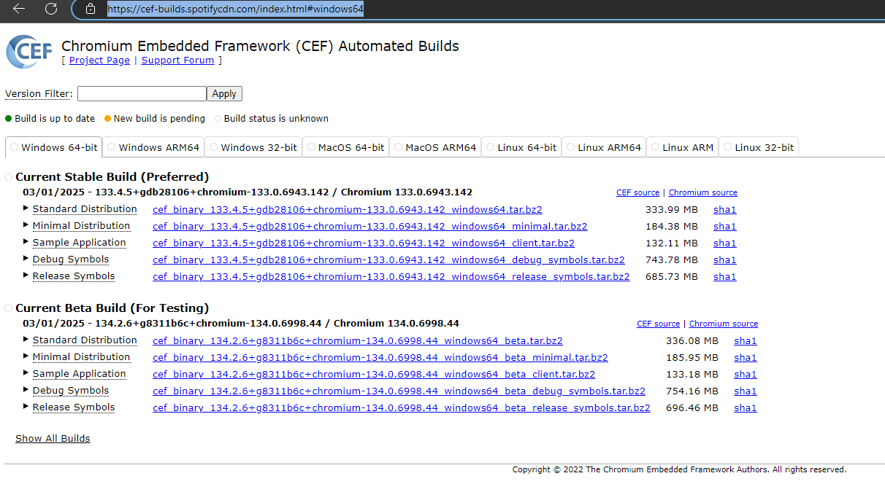

在上方根据自己的系统选择合适的对应版本；

### 2、下载
下面的stable是稳定版，beta是测试版，beta比stable代码更新；

- **Standard Distribution（标准分发版）：**
这是软件的一个完整版本，包含了软件运行所需的所有组件和功能。
它通常适用于大多数用户，提供了全面的功能和支持。
- **Minimal Distribution（精简分发版）：**
相对于标准分发版，精简分发版去除了某些非核心的组件和功能，以减小安装包的大小。
它适用于那些只需要软件核心功能的用户，或者是在资源受限的环境下使用的用户。
- **Sample Application（示例应用）：**
示例应用是一个简单的程序，用于展示如何使用软件的API或特定功能。
它通常作为开发文档或教程的一部分，帮助开发者快速上手和理解软件的使用。
- **Debug Symbols（调试符号）：**
调试符号是一组额外的数据，用于将编译后的二进制文件中的地址映射回源代码的位置。
这些符号对于开发者在调试程序时非常有用，因为它们可以提供关于程序执行过程中发生的错误的详细信息。
- **Release Symbols（发布符号）：**
发布符号与调试符号类似，但它们在软件发布过程中被保留下来，用于支持发布后的调试和分析。
与调试符号不同的是，发布符号通常不包含源代码级别的详细信息，而是提供了足够的信息来帮助开发者定位和解决发布后遇到的问题。

下载 Standard Distribution 并解压得到：
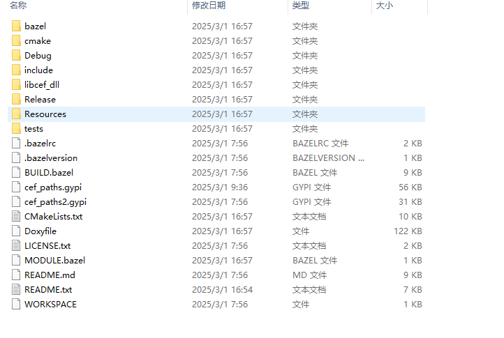

- cmake：包含所有目标共享的CMake配置文件

- Debug：包含构建和运行基于CEF的应用程序的调试版本所需的libcef.dll、libcef.lib和其他组件。默认情况下，这些文件应该与可执行文件放在同一目录中，并将作为构建过程的一部分复制到那里。

- include：包含所有必需的CEF头文件。

- libcef_dll：包含libcef_dll_wrapper静态库的源代码，所有使用CEF C++API的应用程序都必须链接该库。

- Release：包含libcef.dll、libcef.lib和其他必需的组件构建并运行基于CEF的应用程序的发布版本。通过默认情况下，这些文件应与可执行文件，并将作为构建过程的一部分复制到那里。

- Resources：包含libcef.dll所需的资源。默认情况下，这些文件应与libcef…dll放在同一目录中，并将作为构建过程的一部分复制到那里。

- tests/ 演示 CEF 用法的测试目录。

### 3、生成解决方案
使用cmake打开，在“where is the sourrce code” 里输入存放cef源码的路径，在"where to build the binaries"中随便指定一个路径然后加build（指定的build文件夹不存在也没事，一会构建的时候cmake会问你不存在用不用它帮你构建，那时候yes即可），
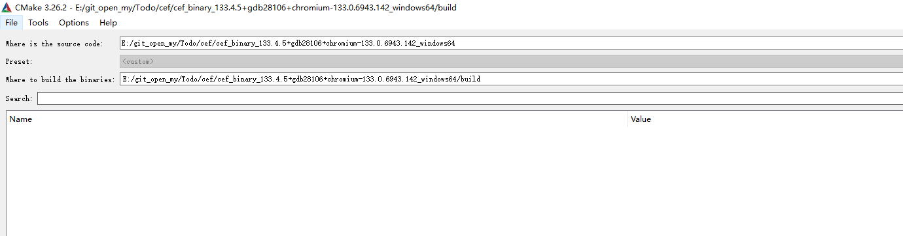

设置好路径之后点击 config,
会弹框让你选自己需要的对应的编译器，
正常的话会显示config done 
***这里要注意，使用VS2019及以下版本的朋友一定要把 USE_SANDBOX 取消选中，因为：***
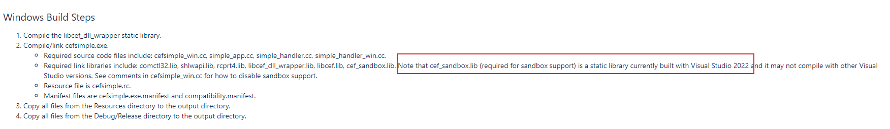
***最新版的cef_sandbox.lib是使用VS2022编译，VS2019等版本使用这个库会报错***

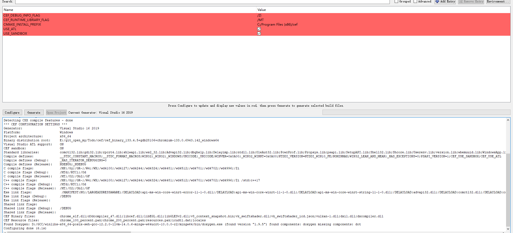

这个时候刚才指定的build文件夹中也会多出一些文件：

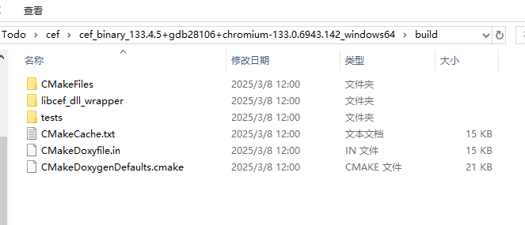

继续点击 Generate： 
成功的话会显示 Generate Donw, 并且Open Project 按钮变亮：
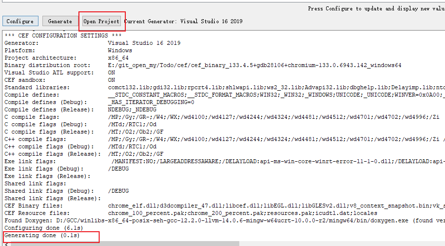

build 文件夹中也会多出对应的工程文件：
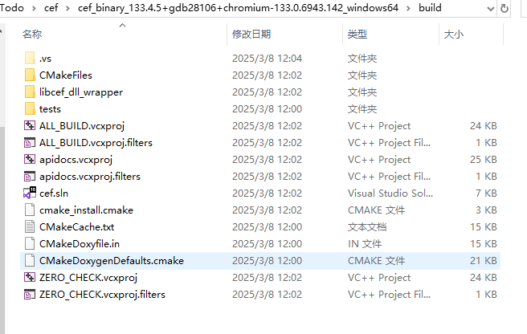

点击 Open Project 打开工程；

### 4、编译
生成解决方案： 
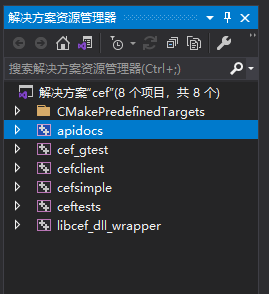

- cef_gtest和ceftests：测试模块
- cefclient：一个包含CEF各种API演示的浏览器程序Demo。
- cefsimple：一个简单的CEF浏览器程序Demo。
- libcef_dll_wrapper：对libcef库的C++代码封装。上述cefclient与cefsimple都会用它。
- apidocs： cef的api接口文档

先编译apidocs（这步可以省略），在VS里右键生成即可，默认会在build的同级目录生成一个 docs 文件夹，里面有个index.html ，浏览器打开就可以不联网本地查看cef接口介绍了，不过是全英文的；
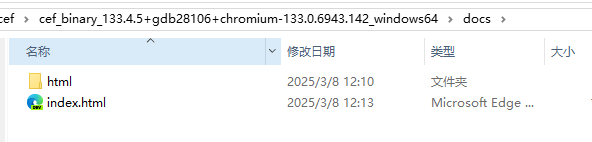

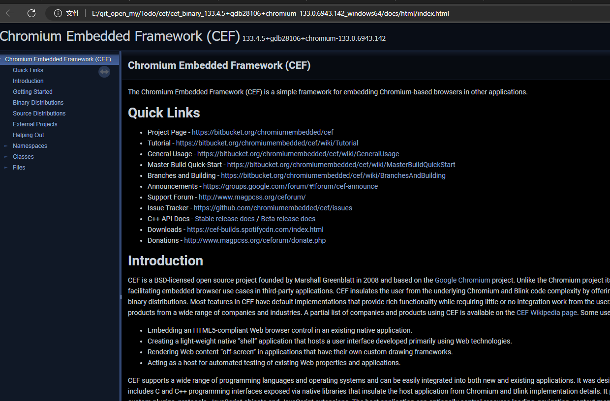

编译cef库，在VS里libcef_dll_wrapper右键生成即可，默认生成的是静态库，生于build\libcef_dll_wrapper\Debug 或者 build\libcef_dll_wrapper\Release :

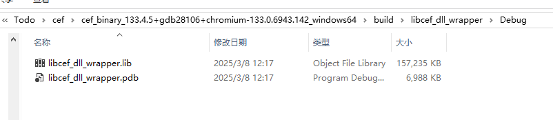

最后可以使用源码带的 cefsimple 测试一下：
*需要先把simple_app.cc中的谷歌网站地址替换为任意地址*
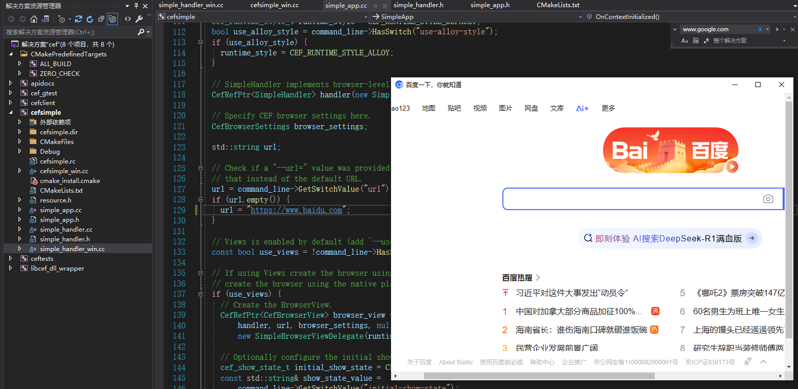